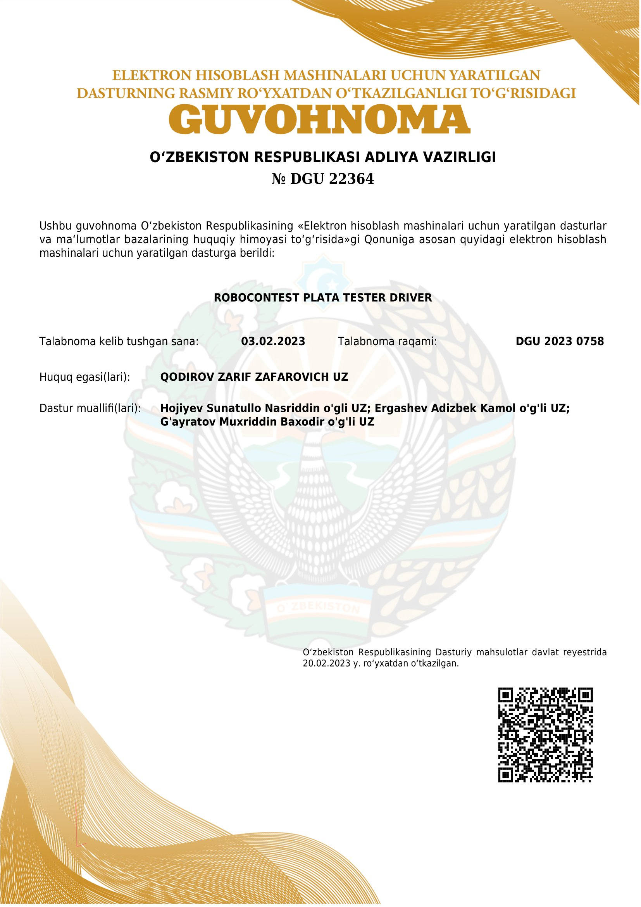

[Robocontest.uz](https://robocontest.uz)
----------------------------------------

### 🧩 Overview

Robocontest.uz is a platform designed for competitive algorithm solving and hosting programming olympiads. It provides a
space for participants to showcase their problem-solving skills, engage in coding competitions, and compete against
fellow programmers.

### 💾 Technical details

The platform is built on a stack consisting of Laravel, Node.js, Docker, RabbitMQ, and Redis. These technologies work
together to create a robust and scalable system that facilitates the smooth running of algorithmic competitions.

### 📦 Supported languages

Robocontest.uz supports a wide range of programming languages and compilers, including:

- [C](https://en.wikipedia.org/wiki/C_(programming_language))
- [C#](https://en.wikipedia.org/wiki/C%23_(programming_language))
- [C# (Mono)](https://en.wikipedia.org/wiki/Mono_(software))
- [C++](https://en.wikipedia.org/wiki/C%2B%2B)
- [Dart](https://en.wikipedia.org/wiki/Dart_(programming_language))
- [Free Pascal](https://en.wikipedia.org/wiki/Free_Pascal)
- [Go](https://en.wikipedia.org/wiki/Go_(programming_language))
- [Java (OpenJDK 1.8.0.282)](https://en.wikipedia.org/wiki/Java_(programming_language))
- [Java (OpenJDK 20)](https://en.wikipedia.org/wiki/Java_(programming_language))
- [Java SE JDK 11.0.11](https://en.wikipedia.org/wiki/Java_SE_JDK_11)
- [JavaScript (Node.js v16.19.1)](https://en.wikipedia.org/wiki/JavaScript)
- [Kotlin](https://en.wikipedia.org/wiki/Kotlin_(programming_language))
- [PascalABC.NET](https://en.wikipedia.org/wiki/PascalABC.NET)
- [PHP](https://en.wikipedia.org/wiki/PHP)
- [PyPy3.9](https://en.wikipedia.org/wiki/PyPy)
- [Python 2.7.17](https://en.wikipedia.org/wiki/Python_(programming_language))
- [Python 3.8.10](https://en.wikipedia.org/wiki/Python_(programming_language))
- [Ruby](https://en.wikipedia.org/wiki/Ruby_(programming_language))
- [Rust](https://en.wikipedia.org/wiki/Rust_(programming_language))
- [Swift](https://en.wikipedia.org/wiki/Swift_(programming_language))
- [TypeScript](https://en.wikipedia.org/wiki/TypeScript)

These compilers enable participants to write and submit code in their preferred programming language, ensuring a diverse
and inclusive environment for algorithmic competitions.

### 📞 Contacts

- [Lazizbek Ergashev](https://t.me/lazizbek_ergashev)
- lazerg2@gmail.com
- +998936268547

### 📝 License
